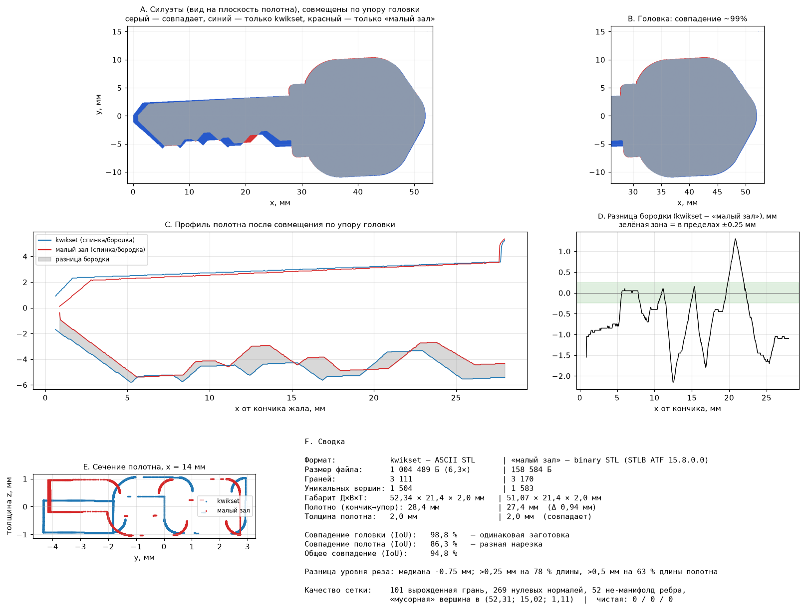
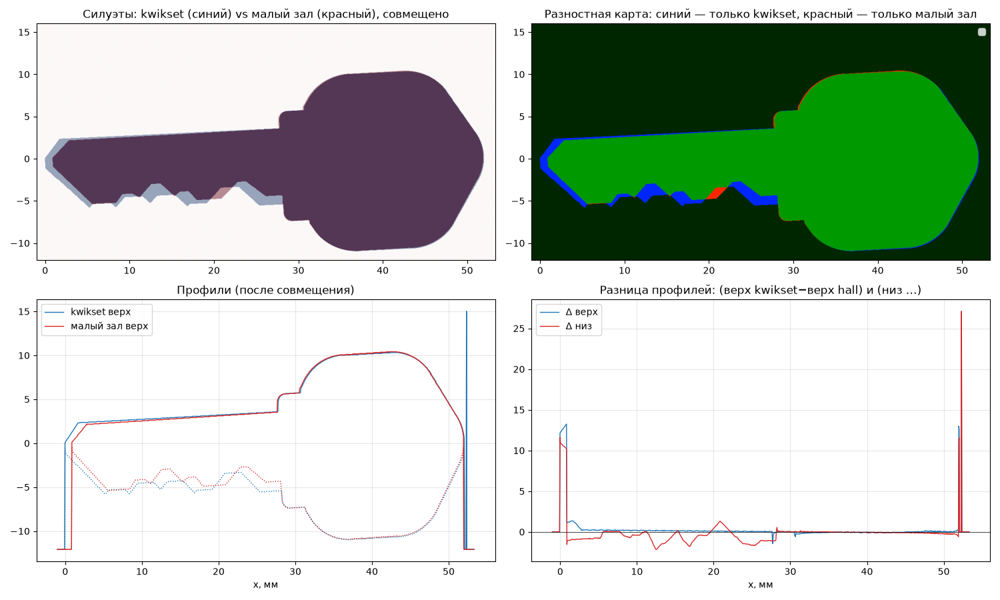
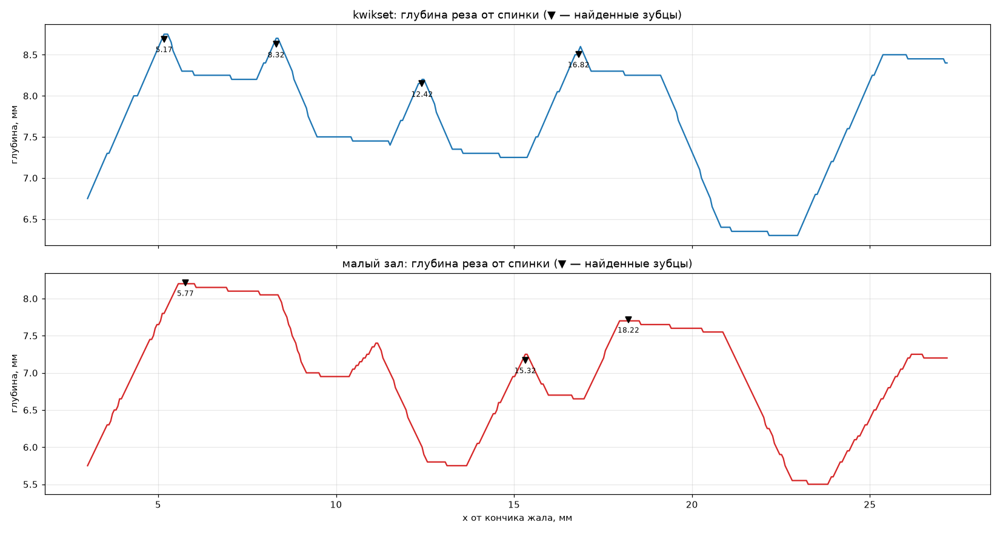
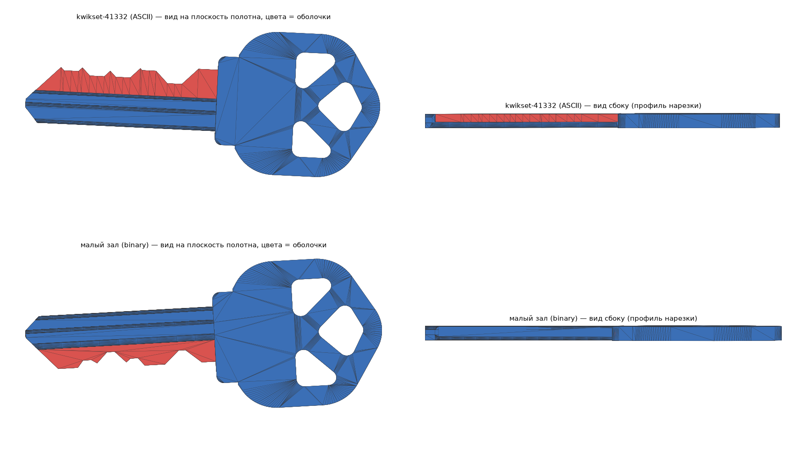

# Сравнение двух STL-файлов

Файлы: `kwikset-41332-1791104343.stl` и `малый зал.stl`.

**Коротко:** это модели **одного и того же ключа-заготовки** (одинаковая головка с 4 отверстиями,
одинаковый профиль и толщина полотна), но **с разной нарезкой бородки и разной длиной полотна**.
Плюс один файл — чистый CAD-экспорт, второй — экспорт с артефактами.

---

## 1. Технические характеристики файлов

| Параметр | `kwikset-41332-1791104343.stl` | `малый зал.stl` |
|---|---|---|
| Формат | **ASCII** STL (`solid ascii`) | **Binary** STL, заголовок `STLB ATF 15.8.0.0 COLOR=…` |
| Размер файла | 1 004 489 Б | 158 584 Б (**в 6,3 раза меньше**) |
| Треугольников | 3 111 | 3 170 |
| Уникальных вершин | 1 504 | 1 583 |
| Триангуляция | ~6,2 грани на вершину | ~6,0 граней на вершину |
| Цвет | нет (ASCII) | атрибут `COLOR` = 20083 (0x4E73, RGB565 → тёмно-зелёный) у всех граней |
| Единицы | мм (габарит ~52 мм — соответствует реальному ключу) | мм |

## 2. Габариты и геометрия

| Параметр | kwikset | малый зал | Разница |
|---|---|---|---|
| Габарит Д×В×Т, мм | 52,34 × 21,4 × 2,0 | 51,07 × 21,4 × 2,0 | длина −1,27 мм |
| Полотно: от кончика жала до упора головки | **28,36 мм** | **27,42 мм** | **−0,94 мм** |
| Толщина полотна | 2,01 мм | 2,01 мм | совпадает |
| Сечение полотна | 10,2 × 2,0 мм с пазом у y ≈ +1…+2 мм | 10,2 × 2,0 мм (тот же паз) | совпадает |
| Головка (высота × длина) | 21,4 × ~23,7 мм | 21,4 × ~23,7 мм | совпадает |
| Отверстий в головке | 4 | 4 | одинаковые |

Отверстия головки совпадают по форме и площади: 40,44 / 29,29 / 21,75 / 21,73 мм² против
40,60 / 29,29 / 21,78 / 21,79 мм² (расхождение ≤ 0,16 мм², центры — в пределах 0,1 мм
относительно упора головки).

## 3. Совпадение силуэтов

Сравнение по бинарным маскам силуэта (вид на плоскость полотна, шаг 0,05 мм), после
совмещения по упору головки (сдвиг 0,94 мм по длине):

| Зона | IoU (пересечение/объединение) | Комментарий |
|---|---|---|
| Головка (x > 27,4 мм) | **98,8 %** | геометрия идентична |
| Полотно (x < 27,4 мм) | **86,3 %** | отличается нарезка |
| Вся деталь | **94,8 %** | |

Точное расстояние «точка → поверхность» (выборка 150 тыс. точек, поиск ближайшего
треугольника): медиана 0,013 мм, 95-й перцентиль 0,08 мм — то есть там, где поверхность
совпадает, она совпадает практически идеально.

## 4. Главное отличие — нарезка (бородка)

Профиль нарезки сравнивался после совмещения по упору головки (упор — единственная
база, которая не «плывёт»: он фиксирует ключ в замке).

| Параметр | kwikset | малый зал |
|---|---|---|
| Высота полотна (спинка − бородка), медиана | 7,65 мм | 6,90 мм |
| … максимум | 9,05 мм | 7,90 мм |
| Число зубцов (пиков глубины) | **4** | **3** |
| Позиции зубцов от кончика жала | 5,2 / 8,3 / 12,4 / 16,8 мм | 5,8 / 15,3 / 18,2 мм |
| Глубина реза в зубцах (от спинки) | 8,69 / 8,63 / 8,15 / 8,50 мм | 8,21 / 7,17 / 7,72 мм |

Разница глубины реза по длине полотна: медиана **−0,75 мм**;
расхождение > 0,25 мм — на **78 %** длины полотна, > 0,5 мм — на **63 %**, > 1 мм — на **34 %**.

Подбор сдвига нарезки вдоль полотна снижает расхождение лишь на 29 %, то есть профили
не сводятся друг к другу простым смещением — **это разные секреты (разная нарезка)**,
а не одна и та же деталь со сдвигом.

## 5. Качество сетки

| Параметр | kwikset | малый зал |
|---|---|---|
| Вырожденных граней (площадь 0) | **101** | 0 |
| Нулевых нормалей | **269** (168 из них — у граней ненулевой площади) | 0 |
| Граничных рёбер (дыры) | 1 | 0 |
| Не-манифолдных рёбер | **52** | 0 |
| Оболочек | 3: 2842 + 268 грани + 1 вырожденная грань | 2: 3094 + 76 граней |
| Посторонние вершины | есть «мусорная» вершина (52,31; 15,02; 1,11) | нет |
| Замкнутость (watertight) | **нет** (не-манифолд шов + вырожденная грань) | да (обе оболочки замкнуты) |
| Записанные нормали совпадают с геометрией | да (≤ 0,06°) | да (≤ 2,3°) |

Последствия для kwikset: из-за «мусорной» вершины bbox растягивается по y с 21,4 до 26,0 мм,
а меш не является водонепроницаемым — при 3D-печати/CAM такой файл потребует починки.
Файл `малый зал.stl` — чистый экспорт без дефектов.

## 6. Связь моделей

79,3 % треугольных граней kwikset имеют в `малый зал.stl` грань **точно такой же формы**
(длины сторон совпадают до 1 мкм), и наоборот — 75,2 %. Это указывает на **общий исходный
меш**: вероятно, один и тот же ключ был отредактирован (нарезка + длина полотна) и повторно
экспортирован, либо оба файла — экспорты из одного источника.

## 7. Выводы

1. **Одинаково:** тип ключа (английский/пиновый, Kwikset-подобный), головка с 4 отверстиями,
   толщина и профиль полотна, диаметр/форма всех элементов головки.
2. **Отличается по геометрии:** длина полотна (28,36 против 27,42 мм, −0,94 мм) и нарезка
   бородки — разное число зубцов (4 против 3) и разные глубины реза (0,5–1,7 мм).
   **Ключи взаимозаменяемы по головке/полотну, но открывают разные замки.**
3. **Отличается по качеству файла:** ASCII-версия содержит артефакты (100+ вырожденных
   граней, нулевые нормали, не-манифолдный шов, «мусорная» вершина) и не является замкнутой;
   binary-версия чистая.
4. Для печати/фрезеровки следует брать `малый зал.stl` как образец качества, но геометрию
   нужного ключа — по нарезке соответствующего файла.

---

### Как получить эти цифры

Скрипты в каталоге `scripts/` (запуск: `python scripts/<файл>.py`, требуются `numpy`,
`matplotlib`, `scipy`):

| Скрипт | Что делает |
|---|---|
| `stl_tools.py` | библиотека: чтение ASCII/binary STL, метрики, топология |
| `align.py` | каноничное выравнивание ключа (жало → x=0, головка → +x) |
| `compare2.py` | плотная выборка точек по поверхности |
| `features.py` | силуэты, привязка по упору головки, профиль нарезки |
| `cuts.py` | поиск зубцов и глубин реза |
| `mesh_struct.py`, `facet_match.py` | оболочки, дефекты, поиск общих граней |
| `comparison_sheet.py` | итоговый лист и сводка |

Картинки сохраняются в `renders/`. Габариты приведены в миллиметрах, если в файле не заданы
иные единицы (проверено: габарит 52 мм соответствует реальному ключу).
